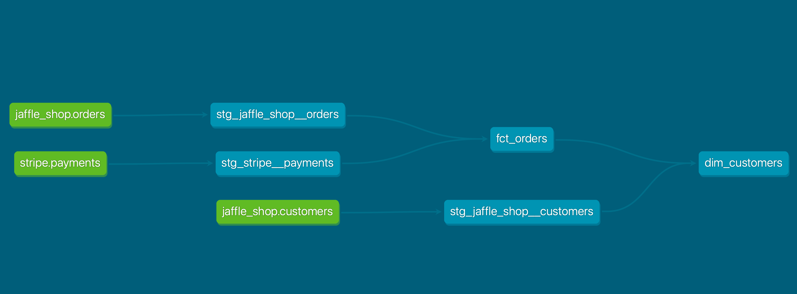

# ETL flow with Spark, Postgres, Docker and dbt

## Overview

This DBT project is designed to transform raw data into a clean and structured format for analysis. It leverages DBT's capabilities to create data models, run tests, and generate documentation. This project is motivated by the course provided by dbt. The conclusion badged can be acessed [clicking here](https://api.accredible.com/v1/auth/invite?code=ca670980af5f4d0e59f1&credential_id=512ed5f1-176e-489b-ba28-6c41001e8e45&url=https%3A%2F%2Fcredentials.getdbt.com%2F512ed5f1-176e-489b-ba28-6c41001e8e45&ident=639e5f9b-990e-4d90-94a4-dfec9ed7555b/)

This project provides the materialization of the transformation lineage bellow:



## Requirements

- **DBT version**: 1.8 or higher
- **Python version**: 3.11 or higher
- **Supported databases:** PostgreSQL

## Setup

### DBT

1. **Install DBT**  
   Follow the [dbt core installation guide](https://docs.getdbt.com/docs/core/installation-overview)

2. **Clone the Repository**  

    ```bash
    git clone https://github.com/xpcosmos/jaffle-shop.git
    cd jaffle-shop
    ```

3. **Configure DBT Profile**

    Edit `profiles.yml` with your database connection details. Use environment variables for sensitive information.

## Usage

1. **Create Database and insert data**

    Use the command bellow to create and insert data into the PostgresSQL running inside the container.

    ```bash
    docker compose up -d
    ```

2. **Run DBT transformation**

    After installing dbt and ensure that the container is running, you must be able to build the models to run and test the transformation flow

    ```bash
    dbt build
    ```

## Documentation

Generate and view documentation:

```bash
dbt docs generate
dbt docs serve
```

## Contributing

Contributions are welcome! Please fork the repository and open a pull request with your changes.
